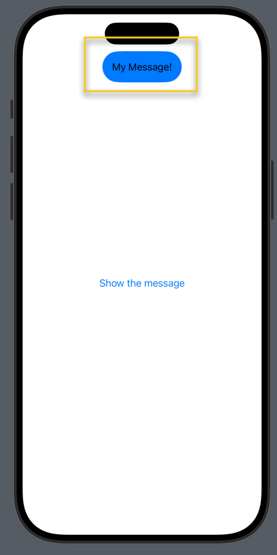

# ToastApp

ToastApp is a simple SwiftUI utility that demonstrates how to display temporary toast banners on top of the screen using a shared service.

## Features

- Display toast messages from anywhere using `ToastService.shared.show(title:)`
- Automatically hides after a few seconds
- Uses `UIHostingController` to overlay SwiftUI view on top of any scene

## Preview



## Usage

Call the following from any view or service:
```swift
ToastService.shared.show(title: "Your message here")
```

Customize duration if needed:
```swift
ToastService.shared.show(title: "Custom duration", duration: 3.5)
```

## License

MIT License
